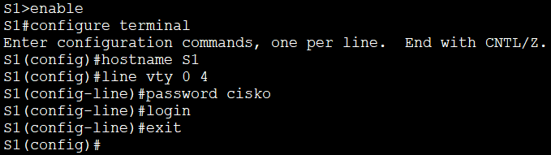
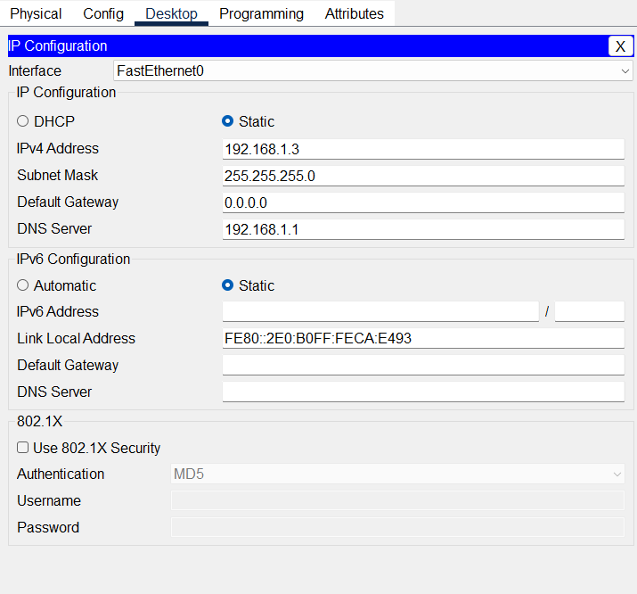
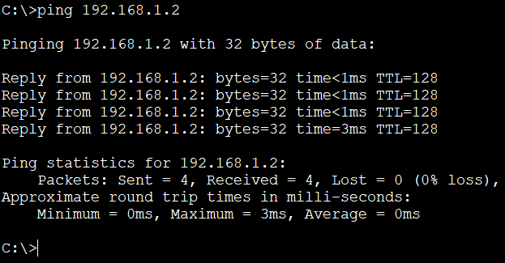
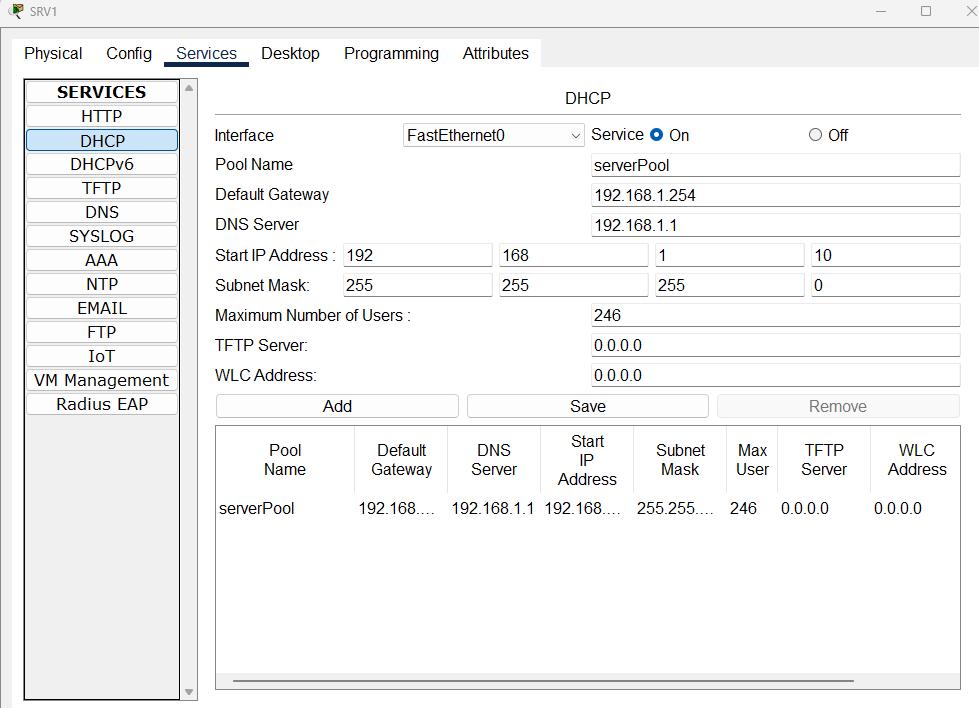
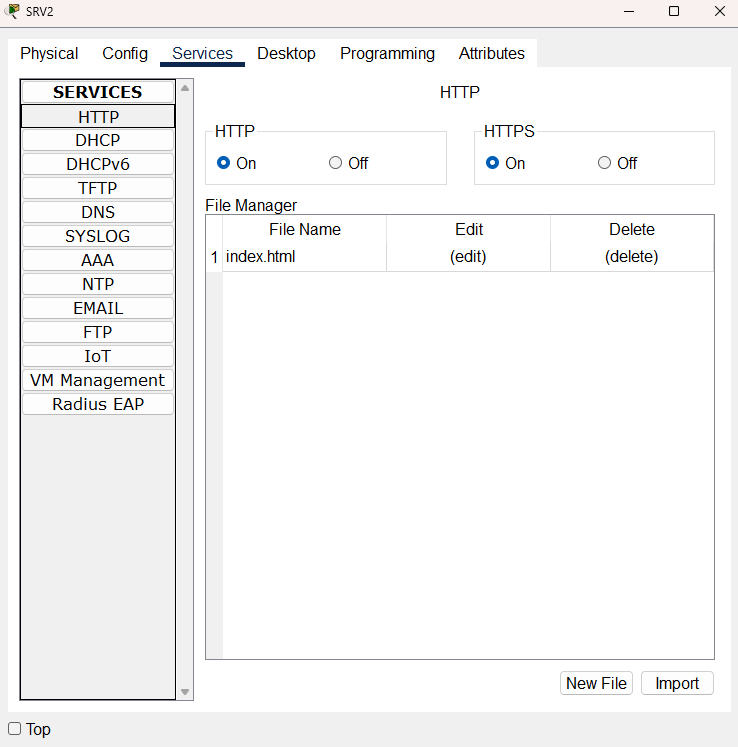

# Projekt LAN - Cisco Packet Tracer

Tento projekt simuluje podnikovou lokální síť (LAN) se dvěma switchi, klientskými počítači a servery poskytujícími služby DHCP, DNS a HTTP.

## 1. Popis sítě

Síť se skládá z následujících prvků:
* **S1 (Switch):** Připojuje PC1 a PC2.
* **S2 (Switch):** Připojuje SRV1 a SRV2.
* **SRV1:** Poskytuje služby DHCP (pro PC2) a DNS (pro doménu [prijmeni].cz).
* **SRV2:** Hostuje webové stránky (HTTP).
* **Laptop:** Slouží ke správě switchů přes konzolový kabel.

---

## 2. Dokumentace a screenshoty

### Konfigurace switche přes Laptop
Nastavení hostname a zabezpečení linky console/vty pomocí terminálu.

### PC1 - IP konfigurace (ipconfig)
Staticky nastavená IP adresa v rámci vypočteného rozsahu.

### Testování konektivity (Ping)
Ověření spojení na SRV2 pomocí IP adresy i doménového jména.

### Nastavení služeb na serverech
#### DNS a DHCP (SRV1)
Záznamy pro doménu a konfigurace dynamického přidělování adres.

#### WEB (SRV2)
Konfigurace HTTP služby s upraveným souborem index.html.

---

## 3. Závěr
Všechny služby jsou plně funkční. PC2 úspěšně získává adresu z DHCP, PC1 dokáže přeložit doménové jméno a zobrazit webovou stránku běžící na SRV2.
